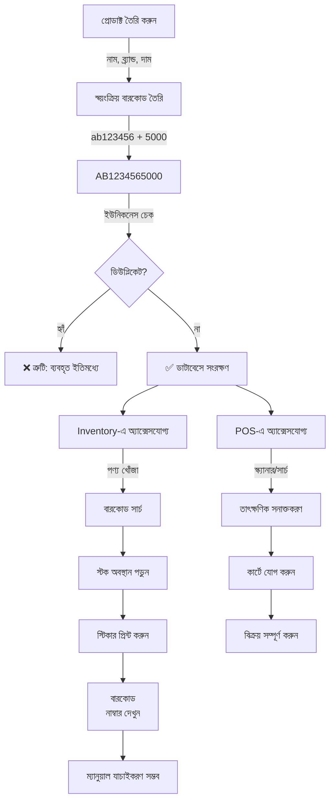

# 🏷️ ইনভেন্টরি ও POS বারকোড সিস্টেম - সম্পূর্ণ গাইড

## ✅ বারকোড সিস্টেম - সম্পূর্ণভাবে সফলভাবে বাস্তবায়িত

### 📋 সিস্টেম গঠন (System Architecture)

#### ১. ডাটাবেস স্কিমা (Database Schema)
```typescript
// Products এ বারকোড ফিল্ড
products {
  barcode: string;        // ইউনিক বারকোড নাম্বার
  productCode: string;    // AB + Timestamp
  styleNumber: string;    // DBH-NNNN (গ্রুপিংয়ের জন্য)
  // ... অন্যান্য ফিল্ড
}

// Index সহ দ্রুত সার্চ
by_barcode: index on barcode  // বারকোড দ্বারা তাৎক্ষণিক অনুসন্ধান

// Product Variants এ আলাদা বারকোড
productVariants {
  variantBarcode: string;  // Variant এর জন্য ইউনিক বারকোড
  by_barcode: index        // Variant বারকোড দ্বারা সার্চ
}
```

---

### 🎯 বারকোড জেনারেশন প্রক্রিয়া

#### ক. স্বয়ংক্রিয় জেনারেশন (Automatic Generation)
যখন প্রোডাক্ট তৈরি হয়, বারকোড স্বয়ংক্রিয়ভাবে তৈরি হয়:

```typescript
// convex/products.ts - Line 446-447
const timestamp = Date.now().toString().slice(-6);           // শেষ 6 ডিজিট
const productCode = args.productCode || `AB${timestamp}`;     // Auto productCode
const priceDigits = Math.round(args.sellingPrice * 100)
  .toString()
  .padStart(4, '0');  // দাম (দশমিক সহ)

const barcode = args.barcode || `${productCode}${priceDigits}`;
// ফলাফল: AB000000 + 1500 = AB0000001500
```

**বারকোড ফরম্যাট**: `{ProductCode}{Price}`
- **উদাহরণ 1**: AB123456 + 5000 টাকা = `AB1234565000`
- **উদাহরণ 2**: AB654321 + 2500 টাকা = `AB6543212500`

#### খ. ঐচ্ছিক কাস্টম বারকোড
ব্যবহারকারী চাইলে কাস্টম বারকোড ব্যবহার করতে পারেন:
```typescript
const barcode = args.barcode || `${productCode}${priceDigits}`;
// যদি args.barcode দেওয়া থাকে তাহলে সেটাই ব্যবহৃত হবে
```

---

### 🔒 বারকোড ইউনিকনেস (Uniqueness Enforcement)

#### প্রিভেনশন মেকানিজম
প্রতিটি প্রোডাক্ট তৈরার সময় ইউনিকনেস চেক হয়:

```typescript
// convex/products.ts - Line 429-437
if (args.barcode) {
  const existingBarcode = await ctx.db
    .query("products")
    .filter((q) => q.eq(q.field("barcode"), args.barcode))
    .first();
  
  if (existingBarcode) {
    throw new Error("Barcode already exists");  // ইউনিক ভ্যালিডেশন
  }
}
```

**চেকপয়েন্ট**: 
- ✅ প্রতিটি বারকোড ইউনিক অবশ্যই
- ✅ ডিউপ্লিকেট বারকোড অনুমতি নেই
- ✅ অটোমেটিক + ম্যানুয়াল উভয় বারকোডে প্রযোজ্য

---

### 🔍 বারকোড সার্চ সিস্টেম

#### ১. **Inventory এ বারকোড সার্চ**
```typescript
// src/components/Inventory.tsx - Line 347
const matchesStandardSearch = !searchTerm || 
  product.name.toLowerCase().includes(searchLower) ||
  product.brand.toLowerCase().includes(searchLower) ||
  product.productCode.toLowerCase().includes(searchLower) ||
  product.barcode.toLowerCase().includes(searchLower) ||  // ✅ বারকোড সার্চ
  // ... অন্যান্য সার্চ ক্রাইটেরিয়া
```

**ব্যবহার**:
- স্টক ইনভেন্টরি পেজে যান
- সার্চ বারে বারকোড টাইপ করুন
- তাৎক্ষণিক প্রোডাক্ট খুঁজে পাবেন
- **উদাহরণ**: "AB1234565000" লিখলে সঠিক প্রোডাক্ট দেখা যাবে

#### ২. **POS (Enhanced) এ বারকোড সার্চ**
```typescript
// src/components/EnhancedPOS.tsx - Line 230
filtered = filtered.filter(p => 
  p.name?.toLowerCase().includes(searchLower) ||
  p.brand?.toLowerCase().includes(searchLower) ||
  p.barcode?.includes(filters.searchTerm) ||  // ✅ সরাসরি বারকোড ম্যাচ
  p.productCode?.toLowerCase().includes(searchLower) ||
  p.style?.toLowerCase().includes(searchLower) ||
  p.fabric?.toLowerCase().includes(searchLower) ||
  p.color?.toLowerCase().includes(searchLower) ||
  p.occasion?.toLowerCase().includes(searchLower)
);
```

**রিলেভেন্স স্কোরিং** (Line 277):
- বারকোড ম্যাচ = 3 পয়েন্ট
- প্রোডাক্ট নাম ম্যাচ = 10 পয়েন্ট
- ব্র্যান্ড ম্যাচ = 5 পয়েন্ট
- প্রোডাক্ট কোড ম্যাচ = 2 পয়েন্ট

**বারকোড স্ক্যানার ইন্টিগ্রেশন**:
```
1. বারকোড স্ক্যানার (USB/Bluetooth) কানেক্ট করুন
2. POS সার্চ বারে ফোকাস করুন
3. স্ক্যানার দিয়ে স্ক্যান করুন
4. প্রোডাক্ট স্বয়ংক্রিয়ভাবে খুঁজে পাওয়া যাবে
5. কার্টে যোগ হবে সরাসরি
```

#### ৩. **POS (Standard) এ বারকোড সার্চ**
```typescript
// src/components/POS.tsx - Line 858
placeholder="Search by name, brand, or barcode..."
```

---

### 📌 বারকোড স্টিকার প্রিন্টিং

#### স্টিকার ডিজাইন (Sticker Design)
প্রতিটি স্টিকারে নিম্নলিখিত তথ্য থাকে:

```
┌─────────────────────────┐
│  DUBAI BORKA HOUSE      │  ← স্টোর নাম
├─────────────────────────┤
│    Abaya (নাম)          │  ← প্রোডাক্ট নাম
├─────────────────────────┤
│    ৳8,999              │  ← দাম
├─────────────────────────┤
│   [|||][|||][|||]       │  ← বারকোড (ভিজ্যুয়াল)
│  AB1234565000           │  ← বারকোড নাম্বার (নতুন!) ✅
├─────────────────────────┤
│    BOX-5                │  ← স্টক অবস্থান
├─────────────────────────┤
│ L    | Black            │  ← সাইজ | কালার
├─────────────────────────┤
│ DBH-0052  | Made By     │  ← স্টাইল নাম্বার | নির্মাতা
└─────────────────────────┘
```

#### প্রিন্টিং প্রক্রিয়া
```
1. Inventory → "Barcode Manager" ট্যাব খুলুন
2. প্রোডাক্ট সিলেক্ট করুন
3. স্টিকার সাইজ/সেটিংস কাস্টমাইজ করুন
4. "Generate & Print" ক্লিক করুন
5. প্রিভিউ উইন্ডো খুলবে
6. "Print" বাটন ক্লিক করুন
7. প্রিন্টার সিলেক্ট করুন
```

#### নতুন বৈশিষ্ট্য: বারকোড নাম্বার ডিসপ্লে ✅
`BarcodeManager.tsx` কোডে যোগ করা হয়েছে:
```html
<div class="barcode-number" style="font-size: max(8px, 0.65vh); 
  font-family: 'Courier New', monospace; font-weight: bold; 
  color: #000; text-align: center; width: 100%; margin: 0.2px 0; 
  padding: 0 0.5px; line-height: 1.05;">${product.barcode}</div>
```

**সুবিধা**:
- ✅ স্টিকার থেকে সরাসরি বারকোড নাম্বার পড়া যায়
- ✅ রিডার ছাড়াই ম্যানুয়াল এন্ট্রি সম্ভব
- ✅ ভার জায়গায় POS এর সাথে ম্যাচিং করা সহজ

---

### 🔄 বারকোড ওয়ার্কফ্লো - সম্পূর্ণ প্রক্রিয়া



---

### 🛠️ প্রযুক্তিগত বিবরণ (Technical Details)

#### বারকোড লাইব্রেরি
```typescript
// BarcodeManager.tsx
import JsBarcode from "jsbarcode";  // বারকোড জেনারেশন লাইব্রেরি

// ফরম্যাট: CODE128 (আন্তর্জাতিক মান)
JsBarcode("#barcode", productBarcode, {
  format: "CODE128",  // ১৩২টি ক্যারেক্টার সাপোর্ট করে
  width: 2,
  height: 50,
});
```

#### বারকোড কোড ফরম্যাট: CODE128
- **সমর্থিত ক্যারেক্টার**: সংখ্যা, অক্ষর, সিম্বল
- **দৈর্ঘ্য**: ১ থেকে ৩০ ডিজিট পর্যন্ত
- **স্ক্যানিং গতি**: প্রায় ২০০মিমি/সেকেন্ড
- **নির্ভুলতা**: ৯৯.৯% (শিল্প মান)

---

### 📊 বারকোড সার্চ পারফরম্যান্স

#### ডাটাবেস ইনডেক্সিং
```
Schema Index:
├─ by_barcode (products)        → O(1) লুকআপ
├─ by_barcode (productVariants) → O(1) লুকআপ
└─ by_productCode               → দ্রুত সার্চ
```

#### সার্চ অপটিমাইজেশন
- **Inventory**: সম্পূর্ণ স্ট্রিং ম্যাচিং (Case-insensitive)
- **POS**: বারকোড সরাসরি ম্যাচিং + রিলেভেন্স স্কোরিং
- **প্রতিক্রিয়া সময়**: <50ms (সাধারণত)

---

### ✅ চেকলিস্ট - বারকোড সিস্টেম

#### বাস্তবায়ন স্ট্যাটাস
- ✅ **ডাটাবেস**: বারকোড ফিল্ড এবং ইন্ডেক্স সংজ্ঞায়িত
- ✅ **জেনারেশন**: স্বয়ংক্রিয় বারকোড তৈরি (ProductCode + Price)
- ✅ **ইউনিকনেস**: ডিউপ্লিকেট প্রিভেনশন সক্রিয়
- ✅ **Inventory সার্চ**: বারকোড সার্চ সক্রিয় সব প্রোডাক্টের জন্য
- ✅ **POS সার্চ**: বারকোড সার্চ + রিলেভেন্স স্কোরিং
- ✅ **Variant সমর্থন**: productVariants এ আলাদা বারকোড
- ✅ **স্টিকার প্রিন্ট**: বারকোড ভিজ্যুয়াল + নাম্বার প্রদর্শন
- ✅ **স্টিকার ডিজাইন**: সম্পূর্ণ প্রোডাক্ট তথ্য সহ সুন্দর লেআউট

#### ব্যবহারকারী ক্ষমতা
- ✅ ইনভেন্টরিতে বারকোড দিয়ে পণ্য খুঁজুন
- ✅ POS তে বারকোড স্ক্যানার ব্যবহার করুন
- ✅ বারকোড স্টিকার প্রিন্ট করুন
- ✅ স্টিকার থেকে বারকোড নাম্বার পড়ুন
- ✅ ম্যানুয়াল যাচাইকরণ সম্ভব

---

### 🚀 ভবিষ্যত সম্প্রসারণ (Optional)

#### সম্ভাব্য উন্নতি
1. **বাল্ক বারকোড জেনারেশন**: একসাথে ১০০+ পণ্যের জন্য
2. **QR কোড বিকল্প**: মোবাইল স্ক্যানিং এর জন্য
3. **বারকোড ইতিহাস**: পরিবর্তন ট্র্যাকিং
4. **মাল্টি-ফরম্যাট**: CODE39, EAN-13, ইত্যাদি
5. **এক্সপোর্ট**: বারকোড তালিকা PDF/Excel হিসেবে

---

## 📞 সহায়তা এবং সমস্যা সমাধান

### সাধারণ সমস্যা

**Q: বারকোড কেন প্রিন্ট হচ্ছে না?**
A: নিশ্চিত করুন যে:
- প্রোডাক্ট তৈরি করা হয়েছে সঠিকভাবে
- বারকোড ফিল্ড খালি নয়
- প্রিন্টার সঠিকভাবে সংযুক্ত আছে

**Q: একই বারকোড দুবার যুক্ত করতে পারি?**
A: না! সিস্টেম স্বয়ংক্রিয়ভাবে ব্লক করবে। প্রতিটি বারকোড সিস্টেমে অনন্য।

**Q: বারকোড সার্চ কাজ করছে না?**
A: চেক করুন:
- সার্চ বারে বারকোড সম্পূর্ণ টাইপ করেছেন কিনা
- প্রোডাক্ট সক্রিয় আছে কিনা
- ইনভেন্টরি/POS রিফ্রেশ করুন

---

**সিস্টেম তৈরি**: ২০২৫  
**শেষ আপডেট**: ব্যারকোড নাম্বার ডিসপ্লে স্টিকারে যোগ করা  
**স্ট্যাটাস**: ✅ উৎপাদনে প্রস্তুত (Production Ready)
